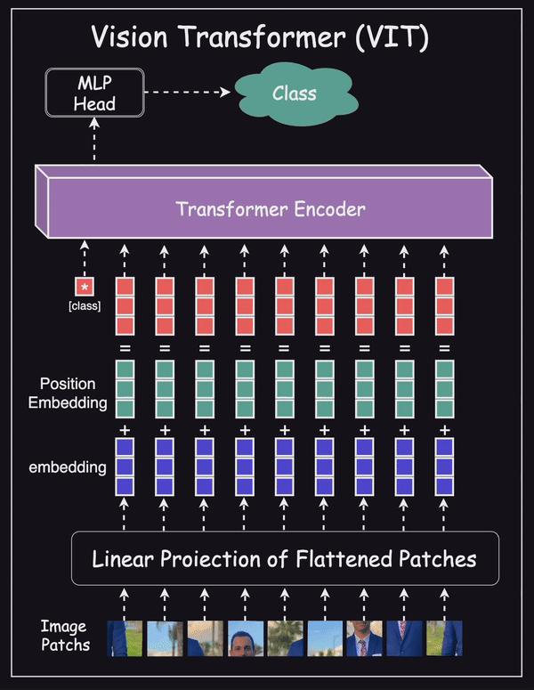
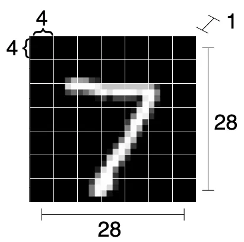

# What are Vision Transformers? 

As introduced in Attention is All You Need, transformers are a type of machine learning model utilizing attention as the primary learning mechanism. Transformers quickly became the state of the art for sequence-to-sequence tasks such as language translation.

An Image is Worth 16x16 Words successfully modified the transformer put forth in to solve image classification tasks, creating the Vision Transformer (ViT). The ViT is based on the same attention mechanism as the transformer in. However, while transformers for NLP tasks consist of an encoder attention branch and a decoder attention branch, the ViT only uses an encoder. The output of the encoder is then passed to a neural network “head” that makes a prediction.

The drawback of ViT as implemented in is that it’s optimal performance requires pretraining on large datasets. The best models pretrained on the proprietary JFT-300M dataset. Models pretrained on the smaller, open source ImageNet-21k perform on par with the state-of-the-art convolutional ResNet models.




## In Vision Transofrmer we're only using the Encoder Block
--------------------------------------------------------------
### So looking at the steps we would have the following

#### 1. Transformer was originally made for sequential data .. how would we do this for images ?, we simply divide our image into patches and turn each patch into a single image and then turn that single image into a single Vector -> for ex : image (28*28 pixels), lets split to 7*7 patches -> 28 / 7 -> we get 4*4 patches = 16 patches .. then we turn every patch of these 16 patches into a single vector that is (7*7 = 49 units long)

#### 2. now we got 4*4 -> 16 vectors each is 49 long 

#### 3. now assuming we have our images as (B,C,W,H) -> we get now (B,7*7,4*4) -> (B,49,16)




1. By the picture, we see that the input image (a) is “cut” into sub-images equally sized.

2. Each such sub-image goes through a linear embedding. From then on, each sub-image is just a one-dimensional vector.

3. A positional embedding is then added to these vectors (tokens). The positional embedding allows the network to know where each sub-image is positioned originally in the image.

4. These tokens are then passed, together with a special classification token, to the transformer encoders blocks

5. transformer encoders blocks :
    1. A Layer Normalization (LN), followed by a Multi-head Self Attention (MSA) and a residual connection. Then a second LN, a Multi-Layer Perceptron (MLP), and again a residual connection. These blocks are connected back-to-back.

6. Finally, a classification MLP block is used for the final classification only on the special classification token, which by the end of this process has global information about the picture.

# What are Embeddings ?

if we have wheat -> we can't use it direclty unless we transform it to flour to make bread

and this is the essence of embedding, something like patches of images, we can't deal with it directly
we need embeddings which is a different representation of the patches, the only thing is that it's ``` Learnable ```  
